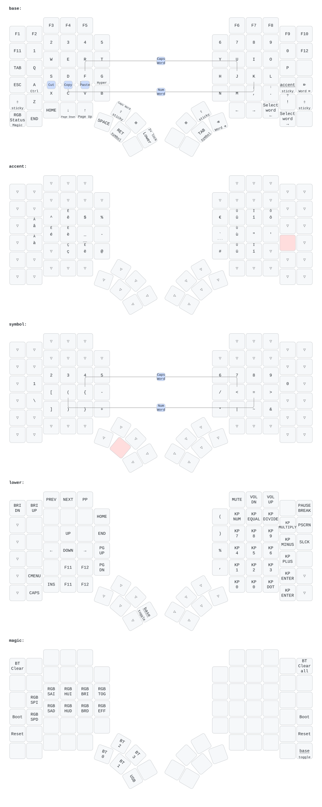

# Glove80 ZMK config

ZMK firmware configuration for a [MoErgo Glove80](https://www.moergo.com/), tuned for macOS. It
builds against [MoErgo's ZMK fork](https://github.com/moergo-sc/zmk) with
[urob's modules](https://github.com/urob) for helper macros, Num Word, and Unicode input.

## Layout

A workflow redraws this diagram after every keymap change on `main`.

## Special keys

### Magic shift

The upper-left thumb key is a Shift with three jobs:

- Hold it for Shift.
- Tap it for a one-shot (sticky) Shift that applies to the next key.
- Tap it while Shift is active, for example the second tap of a double tap, to turn on Caps Word.

The two pinky Shifts and the right thumb Shift are plain sticky Shifts.

### Magic key

The bottom-left corner key shows MoErgo's RGB status overlay when tapped. Held, it opens the magic
layer: Bluetooth profiles 0 to 3, USB output, Bluetooth clear, RGB controls, bootloader, and reset.

### Homerow mods

The left home row holds Ctrl, Option, Cmd, Shift, and Hyper on A, S, D, F, and G. While one is held,
a right-half or thumb key gets the modifier, and another left-half key types the letter, so rolls on
the left hand stay text. Holding a homerow key alone past 280 ms also gives the modifier.

### Long-tap navigation

These keys act on tap and do something bigger when held past 220 ms:

| Key       | Tap       | Long tap               |
| --------- | --------- | ---------------------- |
| Down      | Down      | Page Down              |
| Up        | Up        | Page Up                |
| Backspace | Backspace | Delete the word before |
| Delete    | Delete    | Delete the word after  |

### Combos

Press both keys within 50 ms. Combos fire only when no other key was pressed in the preceding 150
ms, so fast typing does not trigger them.

| Keys  | Action    | Layers       |
| ----- | --------- | ------------ |
| F + J | Caps Word | base, symbol |
| D + K | Num Word  | base, symbol |
| S + X | Cut       | base         |
| D + C | Copy      | base         |
| F + V | Paste     | base         |
| G + H | Gaming    | base, gaming |

### Gaming layer

G + H toggles the gaming layer. It is the base layer with plain A, S, D, F, and G instead of homerow
mods, so held keys never turn into modifiers. The other combos are off while it is active.

### Accent layer

The key right of L is a one-shot switch to the accent layer. It types à â ç è é ê ë î ï ô ù û ü,
lowercase alone and uppercase with Shift, plus €.

The accented characters use macOS hold-Option hex input. Add the **Unicode Hex Input** input source
in System Settings > Keyboard > Text Input and select it. With any other input source, the keys type
the wrong characters.

## Get the firmware

A push that changes `config/`, `build.yaml`, or a workflow builds the firmware in GitHub Actions. To
download it:

1. Open **Actions** > **Build ZMK firmware** and pick a run. **Run workflow** starts a new one.
2. Download the `firmware` artifact and unzip it. It holds `glove80_lh-zmk.uf2` for the left half
   and `glove80_rh-zmk.uf2` for the right half.

## Flash each half

Each half takes its own file. Flash the left half, then the right half:

1. Hold the magic key and press **Boot** on the half you are flashing: the key left of A for the
   left half, or the outer key right of the accent key for the right half.
2. The half mounts as a USB drive (`GLV80LHBOOT` or `GLV80RHBOOT`).
3. Copy the matching `.uf2` file to the drive. The half reboots when the copy finishes.

MoErgo's [Glove80 support site](https://moergo.com/glove80-support) documents the power-on method
for entering the bootloader when the firmware does not respond.

## Update pinned versions

Every dependency is pinned so two builds of the same commit compile identical sources.

- **ZMK:** bump the `zmk` revision in `config/west.yml` and the `moergo-sc/zmk` ref in
  `.github/workflows/build.yml` together, to the same commit. Then re-pin `zephyr` to the commit of
  the branch that ZMK's `app/west.yml` names. Dependabot skips this pin.
- **Modules:** pin `zmk-helpers`, `zmk-auto-layer`, and `zmk-unicode` to the commit of the release
  tag that matches the fork's ZMK version (`v0.3` today). Their `main` branches target a newer
  Zephyr and do not build against the fork.
- **GitHub Actions:** Dependabot opens one grouped update each month.
